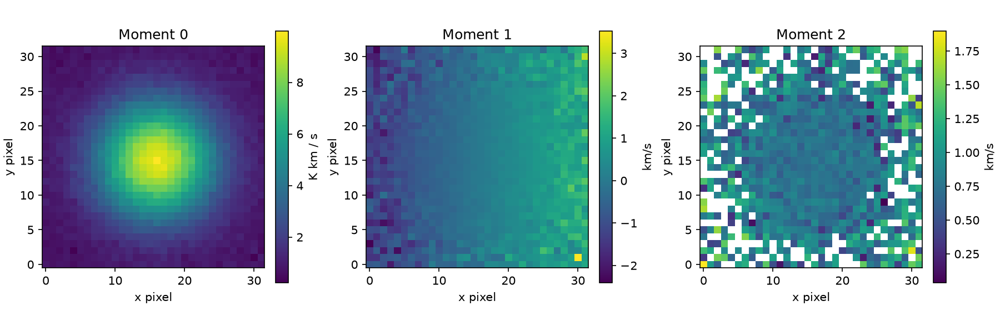
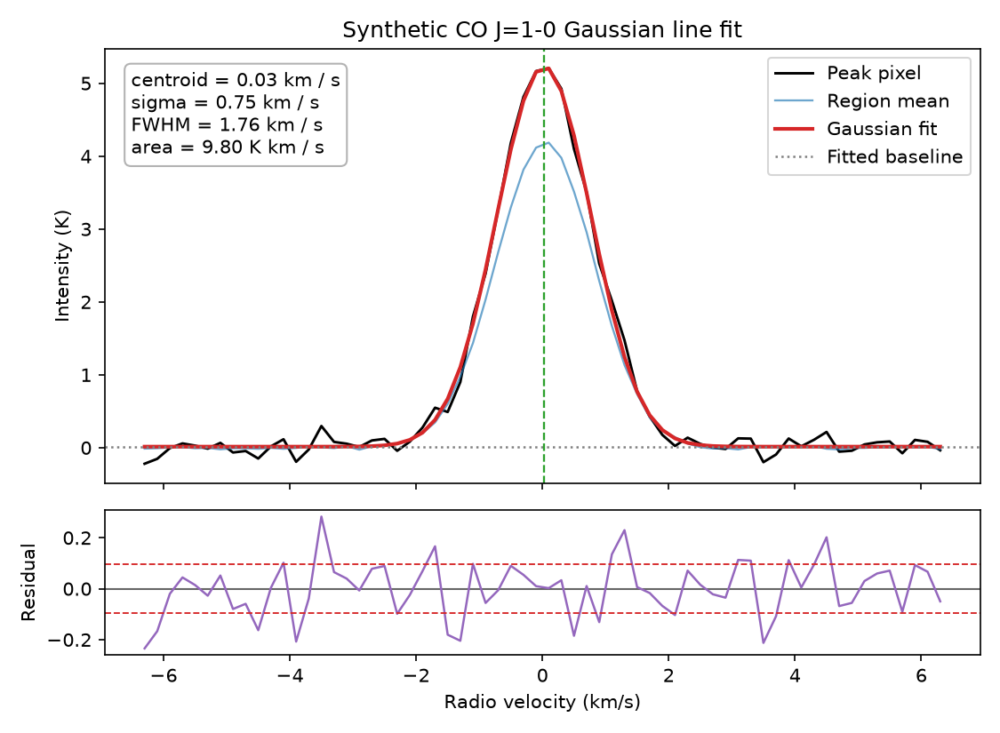
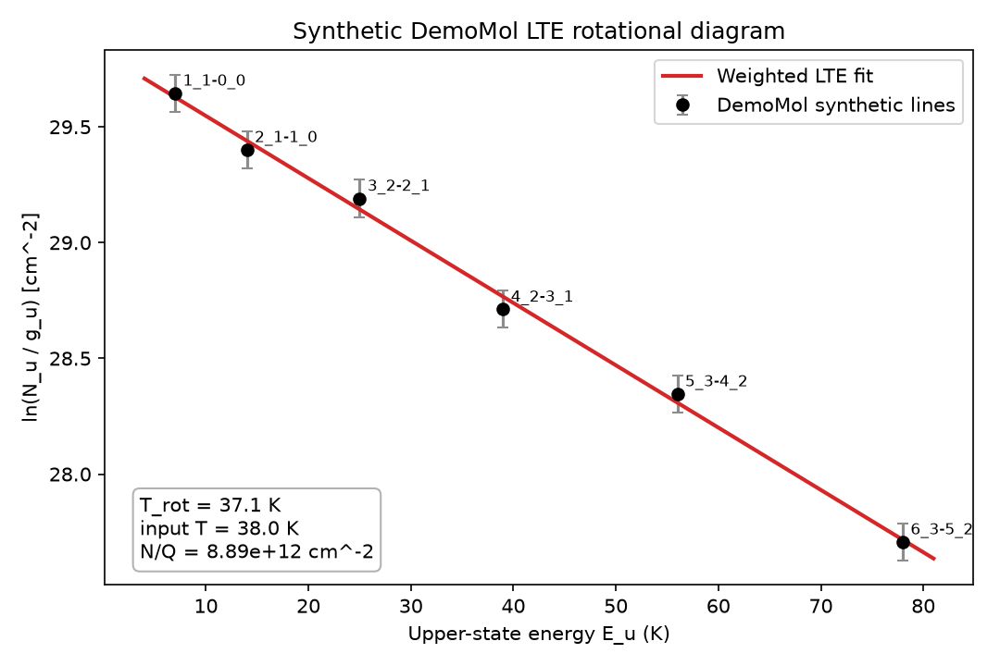

# From Molecular-Line Datacubes to Physical Conditions

A self-directed computational astronomy project exploring a reproducible Python
workflow for molecular-line spectral cubes, Gaussian line measurements, and LTE
rotational-diagram analysis.

## Overview

Millimeter and submillimeter molecular-line observations contain spatial and
spectral information about interstellar gas. Converting these observations into
physical measurements requires several connected steps: reading FITS and WCS
metadata, extracting spectra, measuring line profiles, identifying molecular
transitions, and interpreting multiple transitions through an excitation model.

This project implements a compact version of that workflow using **synthetic
data**. The examples make the repository reproducible without large telescope
downloads while preserving data structures, units, and analysis stages commonly
encountered in radio and molecular astrophysics.

The current implementation reaches an optically thin LTE rotational-diagram
analysis. RADEX-style grid comparison and other non-LTE modelling are planned
but **not implemented**.

## Result Gallery

All figures below are generated from the repository's synthetic demonstration
data.

<table>
  <tr>
    <td width="33%">
      
    </td>
    <td width="33%">
      
    </td>
    <td width="33%">
      
    </td>
  </tr>
  <tr>
    <td align="center"><strong>Moment maps</strong></td>
    <td align="center"><strong>Gaussian line fit</strong></td>
    <td align="center"><strong>LTE rotational diagram</strong></td>
  </tr>
</table>

## Implemented Features

- Generate a reproducible synthetic molecular-line FITS datacube.
- Store celestial WCS, radio-velocity coordinates, brightness-temperature
  units, and beam metadata.
- Load FITS cubes with `spectral-cube`.
- Inspect cube shape, units, spectral range, WCS, and beam properties.
- Extract spectra from individual pixels and rectangular spatial regions.
- Estimate RMS noise from a line-free spectral interval.
- Produce moment 0, moment 1, and moment 2 maps.
- Load and validate a small local molecular-transition catalog.
- Match an input frequency to nearby catalog transitions.
- Fit a single Gaussian emission line with a constant baseline.
- Report amplitude, centroid, velocity dispersion, FWHM, integrated intensity,
  uncertainties, and units.
- Construct an LTE population diagram from same-species transitions.
- Estimate rotational temperature using a weighted linear fit.
- Export figures and tabular results.
- Validate the main numerical workflow with automated tests.

## Analysis Workflow

The repository contains three staged notebooks:

1. **Datacube loading and moment maps**
   - Generate or load a FITS cube.
   - Inspect WCS, units, beam, and spectral-axis metadata.
   - Extract pixel and region-averaged spectra.
   - Estimate line-free RMS noise.
   - Produce moment 0, 1, and 2 maps.
2. **Line identification and Gaussian fitting**
   - Read the cube rest frequency.
   - Match it against a small local transition table.
   - Fit a single Gaussian component to the synthetic spectrum.
   - Inspect the fit and residuals.
3. **LTE rotational-diagram analysis**
   - Load a separate synthetic same-species multi-transition table.
   - Convert integrated intensities to upper-state column densities.
   - Fit the relation

     ```text
     ln(N_u / g_u) = ln(N_tot / Q(T_rot)) - E_u / T_rot
     ```

   - Recover the synthetic rotational temperature.

The Gaussian-fit demonstration and the LTE rotational-diagram demonstration
currently use **two independent synthetic datasets**. The Gaussian fit uses a
synthetic CO J=1-0 cube, while the rotational diagram uses a separate six-line
`DemoMol` table. They demonstrate consecutive analysis methods, but they are not
yet connected as one automated end-to-end pipeline.

## Example Results

All measurements below are synthetic and should not be interpreted as telescope
observations.

### Synthetic cube

| Quantity | Value |
|---|---:|
| Cube shape | 64 x 32 x 32 |
| Brightness unit | K |
| Velocity range | -6.3 to +6.3 km/s |
| Rest frequency | 115.2712018 GHz |
| Matched transition | CO J=1-0 |

### Single-Gaussian fit

Recorded output from the executed synthetic example:

| Parameter | Value |
|---|---:|
| RMS noise | 0.095 K |
| Amplitude | 5.215 K |
| Centroid | 0.026 km/s |
| Gaussian sigma | 0.750 km/s |
| FWHM | 1.765 km/s |
| Integrated intensity | 9.798 K km/s |

### LTE rotational diagram

The six-transition `DemoMol` dataset was generated with an input rotational
temperature of 38 K.

| Quantity | Recovered value |
|---|---:|
| Rotational temperature | 37.14 +/- 1.83 K |
| Synthetic input temperature | 38.00 K |
| `N_tot / Q(T_rot)` | 8.895 x 10^12 cm^-2 |
| Reduced chi-square | 0.333 |

Because `DemoMol` is synthetic and has no physical partition function, the code
reports `N_tot / Q(T_rot)`, not an absolute total column density.

Generated products include:

```text
figures/synthetic_pixel_spectrum.png
figures/synthetic_region_average_spectrum.png
figures/synthetic_moment_maps.png
figures/synthetic_gaussian_line_fit.png
figures/synthetic_rotational_diagram.png

results/synthetic_population_diagram.csv
results/synthetic_rotational_diagram_fit_summary.csv
```

Generated files under `results/` and most files under `figures/` are ignored by
Git by default. The three representative gallery figures shown above are
explicitly included for portfolio display; other regenerable products remain
local unless deliberately added to the allowlist.

## Repository Structure

```text
.
|-- data/
|   |-- demo/
|   |   |-- synthetic_line_cube.fits
|   |   |-- transitions_demo.csv
|   |   `-- demo_rotational_lines.csv
|   |-- raw/                 # Local telescope data
|   |-- processed/           # Local intermediate products
|   `-- external/            # External catalogs or model grids
|-- docs/
|   |-- project_summary.md
|   |-- rotational_diagram_assumptions.md
|   `-- cv_bullets.md
|-- figures/                 # Generated figures (ignored by default)
|-- notebooks/
|   |-- 01_datacube_loading_and_moment_maps.ipynb
|   |-- 02_line_identification_and_gaussian_fitting.ipynb
|   `-- 03_rotational_diagram_LTE.ipynb
|-- results/                 # Generated CSV results (ignored by default)
|-- src/molecular_conditions/
|   |-- datacube.py
|   |-- demo_data.py
|   |-- spectra.py
|   |-- moments.py
|   |-- transitions.py
|   |-- fitting.py
|   |-- rotational_diagram.py
|   `-- radex_grid.py        # Planned interface; not implemented
|-- tests/
|-- pyproject.toml
`-- requirements.txt
```

## Installation

Python 3.10-3.13 is supported.

```bash
git clone <repository-url>
cd <repository-directory>
python -m venv .venv
```

Activate the environment:

```powershell
# Windows PowerShell
.venv\Scripts\Activate.ps1
```

```bash
# macOS or Linux
source .venv/bin/activate
```

Install the package with notebook and development dependencies:

```bash
python -m pip install --upgrade pip
python -m pip install -e ".[dev,notebooks]"
```

Alternatively, install the flat dependency list:

```bash
python -m pip install -r requirements.txt
```

## Running the Project

Start JupyterLab from the repository root:

```bash
jupyter lab
```

Run the notebooks in order:

```text
notebooks/01_datacube_loading_and_moment_maps.ipynb
notebooks/02_line_identification_and_gaussian_fitting.ipynb
notebooks/03_rotational_diagram_LTE.ipynb
```

The notebooks create or update files under `data/demo/`, `figures/`, and
`results/`.

The installed `molecular-conditions` command is currently only a project-status
placeholder. The supported analysis interface is the Python package together
with the notebooks.

## Running the Tests

```bash
pytest
```

The test suite covers synthetic FITS generation and loading, metadata
inspection, spectral extraction, RMS estimation, moment maps, transition
matching, single-Gaussian fitting, unit metadata, population diagrams, and
rotational-temperature recovery.

## Technology Stack

- **Python**
- **Astropy** — FITS files, units, constants, and astronomy metadata
- **spectral-cube** — WCS-aware spectral-cube operations
- **radio-beam** — beam metadata support
- **NumPy** — numerical arrays and synthetic data
- **SciPy** — nonlinear Gaussian fitting
- **Pandas** — transition tables and result export
- **Matplotlib** — diagnostic and analysis figures
- **Jupyter** — reproducible analysis notebooks
- **pytest** — automated tests

`specutils` and `PyYAML` are declared dependencies but are not central to the
current implemented workflow.

## Scientific Assumptions and Limitations

The LTE rotational-diagram analysis assumes:

- optically thin emission;
- local thermodynamic equilibrium;
- one rotational-temperature component;
- a beam filling factor close to one;
- transitions from the same molecular species;
- approximately the same emitting region for all transitions.

The current project does not yet account for:

- optical-depth corrections;
- frequency-dependent beam dilution;
- line blending or multiple velocity components;
- complex spectral baselines;
- correlated calibration uncertainties;
- multiple temperature components;
- a physical molecular partition function;
- non-LTE excitation;
- automated archive or spectroscopy-database access.

Moment maps are calculated over a selected velocity window without a signal
mask. Low-signal pixels, particularly in moment 1 and moment 2, can therefore be
dominated by noise.

The Gaussian uncertainty propagation is a compact demonstration and does not
include the full covariance between fitted amplitude and width when estimating
the integrated-intensity uncertainty.

## Future Work

- Connect measured line intensities directly to the multi-transition excitation
  workflow.
- Support multiple Gaussian components and blended lines.
- Add configurable baseline and spectral-mask handling.
- Apply signal masks before moment-map calculation.
- Ingest real public molecular-line datacubes.
- Integrate a larger, documented spectroscopy catalog.
- Add partition-function support for real molecular species.
- Implement optical-depth and beam-filling corrections.
- Implement the existing RADEX-style non-LTE model-grid interface.
- Compare LTE and non-LTE constraints after the non-LTE workflow exists.
- Replace the placeholder command with a reproducible command-line workflow.

## Project Scope

This repository is a self-directed computational astronomy project developed to
practice and demonstrate molecular-line analysis, scientific Python,
reproducible notebook workflows, and explicit treatment of physical
assumptions.

It is a methodological portfolio project rather than a published observational
result. All currently included measurements are synthetic.
